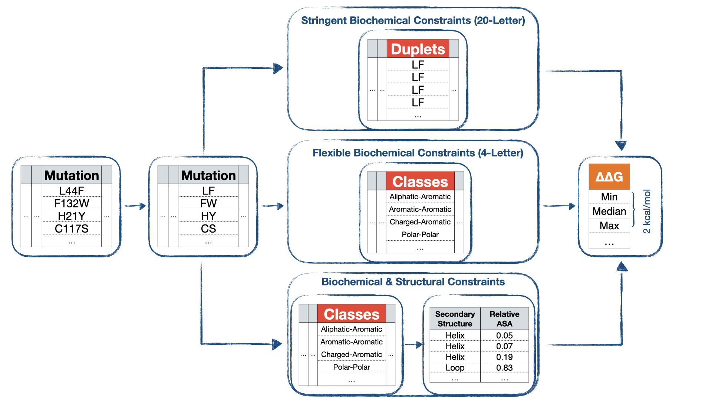

# gRoR
A workflow to get rid of redundant mutations

## How it works?


    
## Installation

You can install the latest released version of `gRoR` from Github with:

```R
install.packages("devtools")
devtools::install_github("narodkebabci/gROR")
```

## Usage

`gRoR` has two main objectives:

1. Construction of class/duplet labels (achieved via `class_formation()` and `duplet_formation()`)
2. Compilation of unbiased mutation datasets (achieved via `class_reduction()` and `duplet_reduction()`)

Note that `gRoR` has dependencies, please read DESCRIPTION before using it. 
